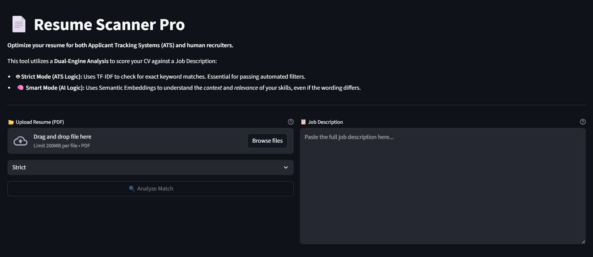
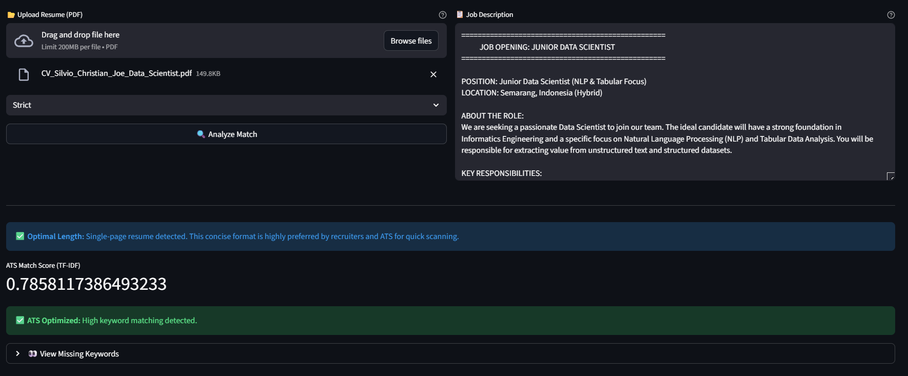
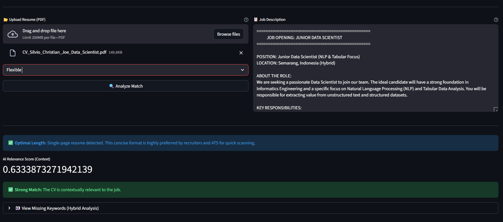
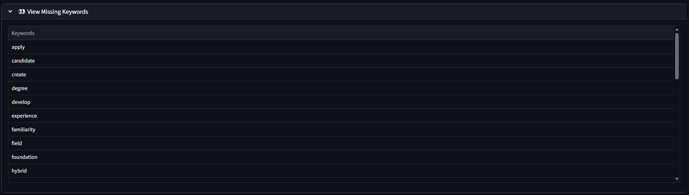

# 📄 Resume Scanner Pro | ATS & AI Analysis


## 📌 Overview
**Resume Scanner Pro** is a powerful **Dual-Engine CV Analysis tool** designed to help job seekers optimize their resumes for both automated **Applicant Tracking Systems (ATS)** and human recruiters.

Unlike simple keyword counters, this tool utilizes a hybrid approach:
1.  **🤖 Strict Mode (ATS Logic):** Uses statistical **TF-IDF (Term Frequency-Inverse Document Frequency)** to rigorously check for exact keyword matches, simulating older, strict ATS algorithms.
2.  **🧠 Smart Mode (AI Logic):** Uses **Semantic Embeddings (SBERT)** to understand the *context* and *meaning* of skills. It recognizes that "Coding" and "Programming" are related, even if the words differ.

## ✨ Key Features

### 🚀 Dual-Engine Analysis
* **Strict Mode:** Perfect for "keyword-heavy" job applications. It calculates a match score based on exact vocabulary overlap.
* **Flexible Mode:** Perfect for modern applications. It uses a pre-trained AI model (`paraphrase-multilingual-MiniLM-L12-v2`) to measure how well the *meaning* of your CV matches the Job Description.

### 🔍 Hybrid Keyword Suggestion
Even when using the **AI Mode** to get a context score, the system runs a background **TF-IDF analysis** to generate a specific list of **"Missing Keywords."**
* *Why?* Because while AI understands context, adding specific keywords ensures you pass the strictest filters.
* **Smart Filtering:** Automatically removes "stop words" (e.g., *the, and, to*) to focus only on high-value professional terms.

### 🛡️ Robust Error Handling
* **Secure Processing:** Handles encrypted/password-protected PDFs gracefully.
* **Data Validation:** Automatically detects empty files, corrupt headers, or insufficient text content.
* **Resource Safety:** Uses cached model loading (`@st.cache_resource`) to ensure high performance without reloading the heavy AI model on every click.

### 📄 Intelligent PDF Parsing
* **Multi-Page Detection:** Automatically detects if a resume is longer than 1 page and provides industry-standard advice on content placement.
* **Single-Page Optimization:** Confirms optimal length for quick recruiter scanning.

## 🛠️ Tech Stack
* **Frontend:** Streamlit.
* **NLP & AI:**
    * `Sentence-Transformers` (SBERT) for Semantic Embeddings.
    * `Scikit-Learn` (TF-IDF Vectorizer) for Statistical Analysis.
* **Data Processing:** Pandas, PyPDF2.
* **Math:** Cosine Similarity (Linear Kernel).

## ⚠️ Requirements & Limitations

### 1. File Format
* **PDF Only:** The system strictly accepts `.pdf` files to ensure accurate text extraction similar to real ATS environments.
* **Readable Text:** The PDF must contain selectable text (not scanned images/photos).

### 2. Language Support
* The system uses the `paraphrase-multilingual-MiniLM-L12-v2` model, which supports **50+ languages**, making it effective for English, Indonesian, and many other languages.
* *Note:* The "Missing Keywords" feature uses English stop-words filtering by default.

## 📦 Installation

1.  **Clone the Repository**
    ```bash
    git clone https://github.com/viochris/streamlit-resume-scanner.git
    cd streamlit-resume-scanner
    ```

2.  **Install Dependencies**
    ```bash
    pip install -r requirements.txt
    ```

3.  **Run the Application**
    ```bash
    streamlit run app.py
    ```

## 🚀 Usage Guide

1.  **Upload Resume:**
    * Click the **"📂 Upload Resume (PDF)"** button on the left panel.
    * *Tip: Ensure your file is not password-protected.*

2.  **Input Job Description:**
    * Paste the full text of the job posting into the **"📋 Job Description"** text area on the right.

3.  **Select Mode:**
    * **Strict:** Choose this if you want to know exactly which words are missing.
    * **Flexible:** Choose this to see how well your experience aligns conceptually with the job.

4.  **Analyze:**
    * Click **"🔍 Analyze Match"**.
    * **Score:** View your match percentage (0-100%).
    * **Missing Keywords:** Expand the dropdown to see specific terms found in the Job Description but missing from your CV.

## 📷 Gallery

### 1. Landing Interface

*The clean, balanced dual-column layout allows users to easily input their CV and the target Job Description side-by-side.*

### 2. Strict Mode Analysis (ATS Logic)

*The system calculates a strict similarity score based on exact vocabulary overlap, simulating rigid ATS filters.*

### 3. Flexible Mode Analysis (AI Logic)

*The AI Engine calculates a semantic relevance score. Even if keywords differ, the system understands the professional context.*

### 4. Actionable Insights

*Regardless of the score, the system provides a detailed list of "Missing Keywords" found in the Job Description but absent from the CV, offering a clear path to optimization.*

---
**Author:** [Silvio Christian, Joe](https://www.linkedin.com/in/silvio-christian-joe)
*"Don't let the ATS reject your dream job. Optimize it."*
